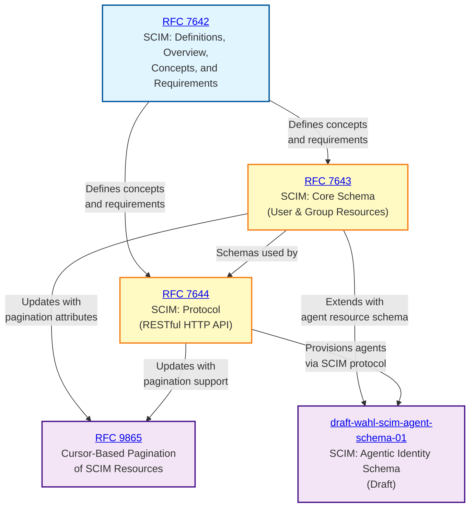

# SCIM Specification Dependency Graph

This graph visualizes the relationships and dependencies between SCIM specifications.

## Legend

- **Blue (Foundation)**: Conceptual foundation - defines terminology, requirements, and use cases
- **Yellow (Core)**: Core technical specifications - schema and protocol definitions
- **Purple (Extension)**: Extensions and enhancements to core specifications

## Relationships Explained

### RFC 7642 → RFC 7643 & RFC 7644

RFC 7642 is the conceptual foundation that establishes:

- What SCIM is and why it exists
- Key terminology and definitions
- Use cases and requirements
- Operational models (push/pull)

Both the schema (RFC 7643) and protocol (RFC 7644) are built upon these foundations.

### RFC 7643 → RFC 7644

The protocol specification (RFC 7644) references and uses the schema specification (RFC 7643):

- The protocol defines how to manipulate resources
- The schema defines what those resources look like
- You need to understand the schema to properly implement the protocol

### RFC 7643 & RFC 7644 → RFC 9865

RFC 9865 extends both the schema and protocol:

- Adds new query parameters to the protocol
- Adds new attributes to resource representations in the schema
- Provides cursor-based pagination as an alternative to index-based pagination
- Maintains backward compatibility with existing implementations

### RFC 7643 & RFC 7644 → SCIM Agentic Identity Schema (Draft)

The agentic identity schema draft (draft-wahl-scim-agent-schema) extends both
the schema and protocol to cover AI agent identities:

- Defines a new `AgenticIdentity` resource type on top of the core schema
- Adds agent-specific attributes (e.g. OAuth client identifiers, application
  IDs) for provisioning autonomous agents
- Reuses the existing SCIM protocol to provision, authenticate, and authorize
  agents
- Status: individual Internet-Draft (not yet WG-adopted); revision -01 is
  expired/archived, so treat it as exploratory rather than stable

## Reading Order

If you're new to SCIM, we recommend reading the specifications in this order:

1. **RFC 7642** - Start here to understand the overall concepts and goals
2. **RFC 7643** - Learn about the data structures and resource types
3. **RFC 7644** - Understand the API operations and protocol details
4. **RFC 9865** - Learn about advanced pagination techniques for large-scale deployments
5. **draft-wahl-scim-agent-schema** - Optional, exploratory: how SCIM is being extended to provision AI agent identities

## Implementation Checklist

When implementing SCIM, ensure you:

- [ ] Understand the use cases and requirements from RFC 7642
- [ ] Implement the User and Group schemas from RFC 7643
- [ ] Support core CRUD operations from RFC 7644
- [ ] Implement filtering and sorting capabilities from RFC 7644
- [ ] Consider cursor-based pagination from RFC 9865 for large datasets
- [ ] Support bulk operations if needed (RFC 7644)
- [ ] Implement proper error handling (RFC 7644)
- [ ] Track the agentic identity schema draft (draft-wahl-scim-agent-schema) if provisioning AI agent identities
